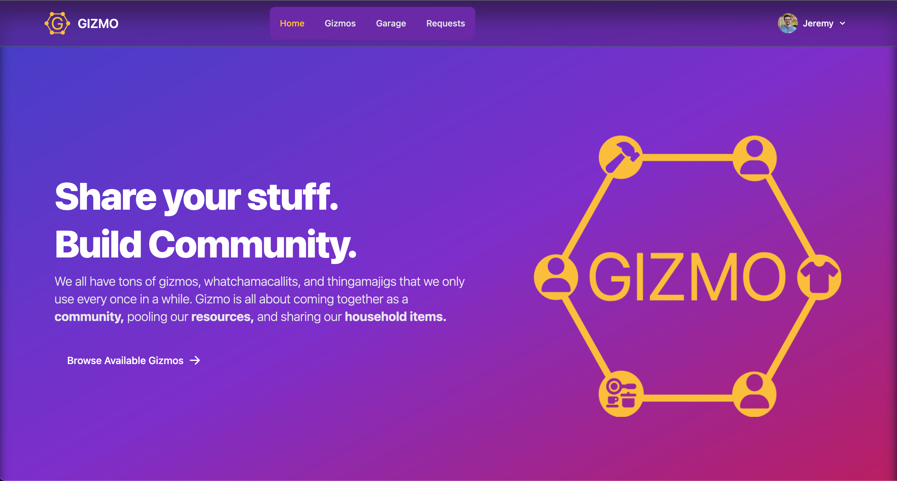
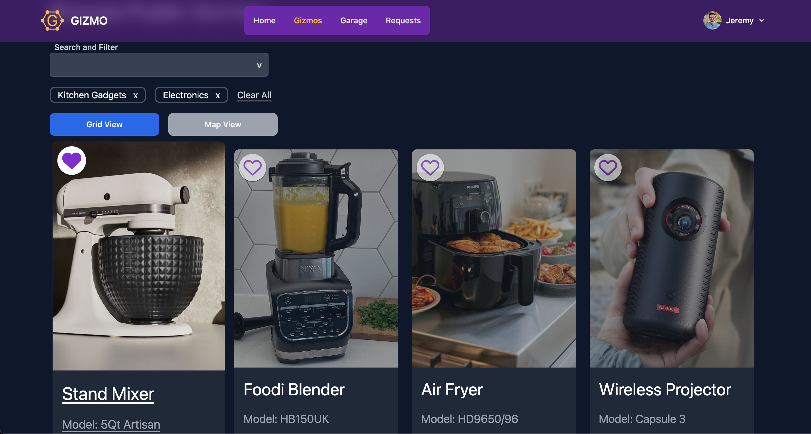

# Gizmo



Gizmo is an application that allows users to share their personal belongings with other users. We all own a bunch of whatchamacallits, thingamajigs, normal household items. Let's reduce waste and create sustainable communities where we share our assets with everyone around us.

This project was created as a Front End Capstone project while attending Nashville Software School's Full Stack Web Development Bootcamp. It was completed with one week of planning and 3.5 weeks of coding.

## Table of Contents

- [Gizmo](#gizmo)
  - [Table of Contents](#table-of-contents)
  - [Project Description](#project-description)
  - [Technologies Used](#technologies-used)
    - [Technologies I had previous experience with:](#technologies-i-had-previous-experience-with)
    - [Technologies I had no previous experience with:](#technologies-i-had-no-previous-experience-with)
    - [Why I chose these technologies](#why-i-chose-these-technologies)
  - [Challenges Faced](#challenges-faced)
  - [Current Features](#current-features)
    - [For Un-Authorized users:](#for-un-authorized-users)
    - [For Authorized Users:](#for-authorized-users)
  - [Possible Future Features](#possible-future-features)
  - [How to Install and Run](#how-to-install-and-run)
  - [Credits](#credits)
  - [Links](#links)

## Project Description




This application finally resolves a problem we've all faced in our lives: "I need to borrow a ${insert random item here} for a few days. Anyone got one?" I know I have faced this problem before numberous times. Sometimes it's a tree limb that falls in my yard and I need a chainsaw to cut it up. Sometimes it's a folding table that I need to borrow for a special event I'm hosting. The list goes on and ON.

Gizmo solves this problem by allowing users to browse and search for gizmos in their area. If a user wants to borrow a gizmo, they must request it for a specific period of time. The owner of that gizmo can then decide to accept or reject the request.

## Technologies Used

<a href="https://reactjs.org/" title="React JS"></a>
<a href="https://reactrouter.com/en/main" title="React Router"></a>
<a href="https://developer.mozilla.org/en-US/docs/Web/JavaScript" title="JavaScript"></a>
<a href="https://tailwindcss.com/" title="Tailwind"></a>
<a href="https://flowbite.com/" title="Flowbite"></a>
<a href="https://maps.google.com/" title="Google Maps"></a>
<a href="https://www.npmjs.com/" title="npm"></a>
<a href="https://www.firebase.com/" title="Firebase"></a>
<a href="https://react-query-v3.tanstack.com/" title="React Query"></a>

### Technologies I had previous experience with:

- Javascript ES6 and ReactJS with React Router to create a single page application.
- <a href="https://github.com/typicode/json-server" title="JSON Server">JSON Server API</a> to interface with a local JSON database.

### Technologies I had no previous experience with:

- TailwindCSS and Flowbite Components for styling.
- Google Maps API to display geocode data on a map, and Google Places API to generate geocode data based on user input.
- Headless UI, Google Places Autocomplete npm packages.
- Firebase for email/password and Google authentication.
- Firebase for image file upload.
- React Query for asynchronous State Management.

### Why I chose these technologies

1. One of the project requirements was that this application had to use Javascript ES6/ReactJS/React Router.
2. I found that TailwindCSS and Flowbite allowed for quick creation and editing of styles. I appreciate that Tailwind's use of utlity classes allows for a single source of truth regarding a component's styling without the need to manage multiple .css files.
3. I wanted to challenge myself to display data in a way other than a grid or list. The Google Maps API allowed me to do that. It also opened up more challenge on how to capture geocode from a user's input.
4. Headless UI had powerful unstyled components that worked very well with Tailwind's styling approach.
5. After comparing Google Firebase and Amazon Cognito, I found that Firebase provided all of the features I needed for authentication. Firebase's file upload also seemed straightforward
6. I wanted to explore different options for a global state management library. I considered redux and React Query (aka TanStack Query) I thought that for the purpose of this application, React query had specific tooling for caching data returned from async API calls. React Query keeps that data up to date and reduces the amount of unneccessary fetching when the user mounts/unmounts certain components.

## Challenges Faced

One big challenge I faced was learning the patters used with React Query. Basic fetching and displaying of data was straightforward. But if I needed to manipulate or use the data to carry out some other opertaion, that was more complex than I expected.

Before starting this application, a stretch goal I had was to deploy this application in a secure manner. I quickly discovered that what I was looking for was a full-stack app with a custom API that could provide custom routes and responses. I decided not to deploy an application that wasn't optimized or allowed users to see private info from other users.

## Current Features

### For Un-Authorized users:

- Users can browse gizmos in a grid view or map view.
- Gizmos on the map view go through a location algorithm before being displayed on the map. The algorithm randomizes the coordinates within a small variation, allowing for security and peace of mind that the exact location of a user's personal property isn't displayed on the map.
- Users can search for gizmos by Keyword, Category, or a combination of both. Input field is a combobox that allows users to start typing and see matching categories or create their own search term. Users can select multiple categories.
- Gizmos are paginated, only showing 20 gizmos at a time.
- Users Can see how many total gizmos match their search query, and what range of items are currently being displayed on the page.
- Dark/Light mode of the application. The UI follows the computer system's setting of dark or light.

### For Authorized Users:

- All of the features of unauthorized users.
- Users can sign-in with Google.
- Users can create a user profile.
- Users can input a street address in a form field that will autocomplete that address as they type. That address is then converted to lat/lng coordinates which is used for locating that user's gizmos.
- Users can request a tool for a specific timeframe and provide a message with the request.
- Users can create gizmos for their own collection that can be public or private.
- Users can see requests they have submitted for other user's gizmos as well as requests that other users have made for their gizmos.
- Users can edit, accept, or decline requests.
- Accepted requests can be tracked and users can mark gizmos that have been borrowed as returned when they recevie the gizmo back.

## Possible Future Features

- Making Gizmo a full stack, deployed application.
- Integrating charts and graphs for a user's gizmos to see how their inventory has grown over time, how many times certain gizmos have been shared, and an ROI on frequently used gizmos.
- Integrating image capture so a User can take a photo of their gizmo directly rather than uploading a previously taken photo.
- Creating an Activites feed where users can create an actitity, tag specific tools they own or tools they have borrowed, and share that activity so others can like and comment on it.

## How to Install and Run

1. git clone this repo to your local machine.
2. Setup Firebase project for authentication and photo storage. Setup Google Maps and Places APIs. For step-by-step instructions for this process, check out this file <a href="/firebaseInstructions.md">here.</a> (If Employer, contact me through LinkedIn <a href="https://www.linkedin.com/in/jeremy-white-dev/" target="_blank">Here</a>)
3. Navigate to the repo on your machine and run the following commands in the terminal:

```
cp .sample.db.json gizmo-db.json
cp .sample.env .env.local

```

4. Update the `.env.local` file with the Firebase and Google Maps API keys created in the previous step.
5. Make sure that Node.js and npm are installed on your machine. <a href="https://docs.npmjs.com/downloading-and-installing-node-js-and-npm">Click here for installation.</a>
6. Run the following commands in the terminal:

```
npm i
npm i json-server -g
```

7. Setup is complete! Use the following commands to run Gizmo locally. These commands may have to be run in separate terminal windows.

```
json-server -p 8088 gizmo-db.json
npm start run
```

6. Enjoy the App!

## Credits

I want to thank everyone in my NSS Cohort that helped me out with this project. The instructors gave me meaningful insight into what would be best to focus on in this application.

## Links

<a href="https://dbdiagram.io/d/637446b2c9abfc611172f52f" target="_blank">Project ERD</a> || <a href="https://dbdiagram.io/d/63bc1f9e6afaa541e5d14424" target="_blank">Wireframe</a> || <a href="https://dbdiagram.io/d/637446b2c9abfc611172f52f" target="_blank">Project STRETCH ERD</a>
