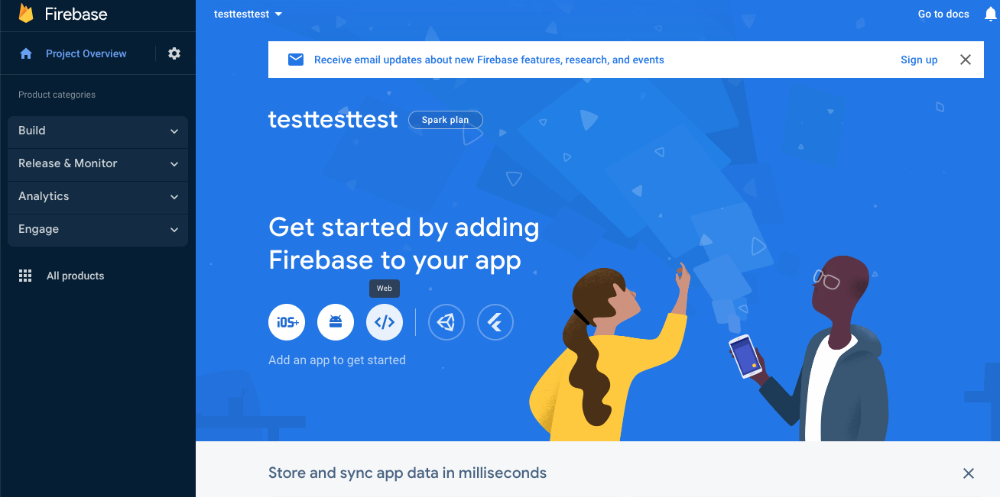
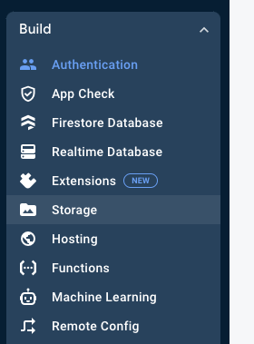
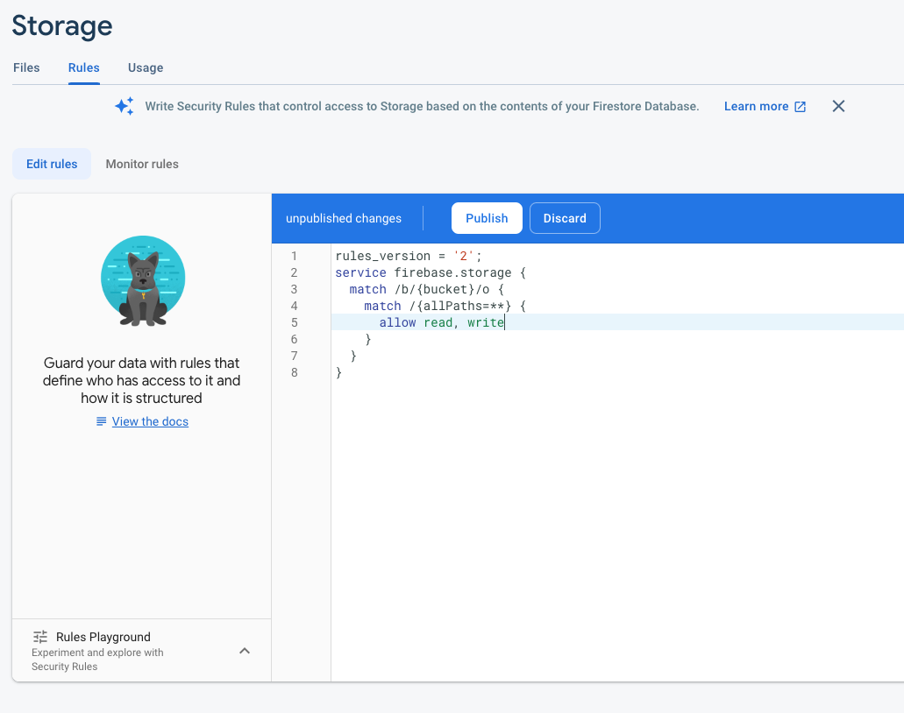
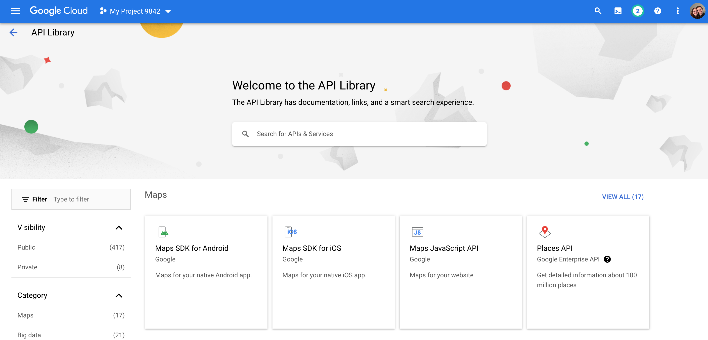

## Step 1: Create a Firebase Account & Initialize Products

- Go to https://firebase.google.com/ and create an account. It's free!
- Add a new project for your app IMPORTANT! DISABLE google analytics (it will ask you when it asks for your app name)
- It will ask you to enable Firebase.

- Make sure you pick the "web" button. Give your app a nickname and click next. In step 2 make sure to copy the API Keys to your .env.local file.
- Next it will ask you to "Choose Products You Want To Add To You App". Choose Authentication click the "get started" button and enable email/password.
- After that is done click the "enable a new provider" and choose google.
- PHOTO STORAGE: Go into the side menu under "build" and choose storage.

- click the "Get Started" button
- When prompted make sure you select to use Production Mode.
- Click next when it asks you which region you want (stick with the default).
- Go into the "Rules" tab and change them to match what is below. Click the "publish" button.

## Step 2: Create Google Developer Account & Initialize APIs

- Go to https://console.cloud.google.com/ and create an account. It's free!
- Add a new project for your app.
- Go to APIs & Services => Library.
- Select Maps Javascript API and enable. IMPORTANT! Deselct the "Enable All Google Maps APIs" checkbox. Copy the API key to your .env.local file.
- Go back to APIs & Services, select Places API and enable.

**_It is recommended that you set budgets for these services so as not to incur unexpected expenses_**

**YOU'RE ALL SET**
